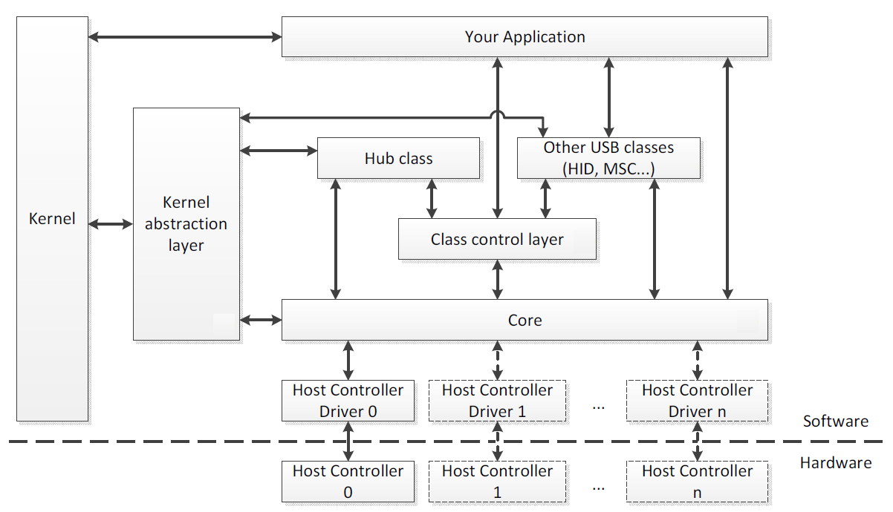

# Драйвер устройства - что это? | Документация Metalfish OS

## [Главная страница](./index.md)

*Драйвер устройства* — это компьютерная программа управляющая строго определенным типом устройства, подключенным к или входящим в состав любого настольного или переносного компьютера.

Основная задача любого драйвера – это предоставление софтового интерфейса для управления устройством, с помощью которого операционная система и другие компьютерные программы получают доступ к функциям данного устройства, «не зная» как конкретно оно используется и работает.

Обычно драйвер общается с устройством через шину или коммуникационную подсистему, к которой подключено непосредственное устройство. Когда программа вызывает процедуру (очередность операций) драйвера – он направляет команды на само устройство. Как только устройство выполнило процедуру («рутину»), данные посылаются обратно в драйвер и уже оттуда в ОС.

Любой драйвер является зависимым от самого устройства и специфичен для каждой операционной системы. Обычно драйверы предоставляют схему прерывания для обработки асинхронных процедур в интерфейсе, зависимом от времени ее исполнения.

Любая операционная система обладает «картой устройств» (которую мы видим в диспетчере устройств), для каждого из которых необходим специфический драйвер. Исключения составляют лишь центральный процессор и оперативная память, которой управляет непосредственно ОС. Для всего остального нужен драйвер, который переводит команды операционной системы в последовательность прерываний – «двоичный код».

### Как работает драйвер и для чего он нужен?

Основное назначение драйвера – это упрощение процесса программирования работы с устройством.

Он служит «переводчиком» между хардовым (железным) интерфейсом и приложениями или операционными системами, которые их используют. Разработчики могут писать, с помощью драйверов, высокоуровневые приложения и программы не вдаваясь в подробности низкоуровневого функционала каждого из необходимых устройств в отдельности.

Как уже упоминалось, драйвер специфичен для каждого устройства. Он «понимает» все операции, которые устройство может выполнять, а также протокол, с помощью которого происходит взаимодействие между софтовой и железной частью. И, естественно, управляется операционной системой, в которой выполняет конкретной приложение либо отдельная функция самой ОС («печать с помощью принтера»).

Если вы хотите отформатировать жесткий диск, то, упрощенно, этот процесс выглядит следующим образом и имеет определенную последовательность: 

1. Сначала ОС отправляет команду в драйвер устройства используя команду, которую понимает и драйвер, и операционная система. 
2. После этого драйвер конкретного устройства переводит команду в формат, который понимает уже только устройство. 
3. Жесткий диск форматирует себя, возвращает результат драйверу, который уже впоследствии переводит эту команду на «язык» операционной системы и выдает результат её пользователю 

### Как создается драйвер устройства

Для каждого устройства существует свой строгий порядок выполнения команд, называемой «инструкцией». Не зная инструкцию к устройству, невозможно написать для него драйвер, так как низкоуровневые машинные команды являются двоичным кодом (прерываниями) которые на выходе отправляют в драйвер результат, полученный в ходе выполнения этой самой инструкции.

При создании драйвера для Линукса, вам необходимо знать не только тип шины и ее адрес, но и схематику самого устройства, а также весь набор электрических прерываний, в ходе исполнения которых устройство отдает результат драйверу.

Написание любого драйвера начинается с его «скелета» — то есть самых основных команд вроде «включения/выключения» и заканчивая специфическими для данного устройства параметрами.

### И чем драйвер не является

Часто драйвер устройства сравнивается с другими программами, выполняющими роль «посредника» между софтом и/или железом. Для того, чтобы расставить точки над «i», уточняем:

 + Драйвер не является интерпретатором, так как не исполняется напрямую в софтовом слое приложения или операционной системы.
 + Драйвер не является компилятором, так как не переводит команды из одного софтового слоя в другой, такой же.
